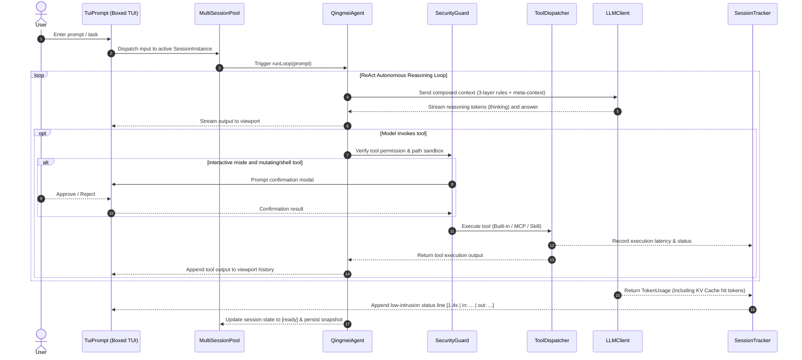

# Qingmei (青袂) - System Architecture & Design Document

<p align="center">
  <b>English</b> | <a href="DESIGN.zh-CN.md">简体中文</a> | <a href="README.md">README</a> | <a href="CHANGELOG.md">Changelog</a>
</p>

---

This document provides a comprehensive technical overview of **Qingmei (青袂) CLI**'s system architecture, core engineering sub-systems, security model, and terminal design philosophy.

---

## 1. System Positioning & Design Philosophy

### 1.1 Vision
Qingmei (青袂) is an open-source, modern, modular, and high-density autonomous AI Agent Command Line Interface (CLI) built with TypeScript and Node.js. It is designed to provide software engineers with an ultra-focused, responsive, secure, and **zero-workspace-pollution** programming and reasoning companion.

### 1.2 Core Design Principles

1. **Zero-Config Launch (Instant REPL)**:
   Launching the CLI requires only typing `qingmei`. Unconfigured installations trigger an intuitive, zero-latency setup wizard that probes connectivity and selects recommended model presets without cumbersome flags.
2. **Zero Workspace Pollution**:
   All user configuration files, session memory snapshots, prompt caching metrics, MCP configurations, and global directives are strictly stored under `~/.qingmei/`. The user's active codebase repository is never polluted with tool-specific configuration artifacts.
3. **Autonomous ReAct Reasoning Loop**:
   Multi-step autonomous tool use loop with streaming thought/reasoning chains, adaptive infinite loop detection, and reflective self-healing.
4. **Multi-Session Concurrency Pool**:
   Flat parallel multi-session pool supporting non-blocking background asynchronous execution and rapid `Tab` hotkey switching within a single workspace.
5. **Zero Icons & High-Density Minimalist TUI**:
   100% free of Emojis and decorative symbols. Pure-text status badges (`[running]`, `[ready]`, `[waiting]`, `[done]`, `[error]`) maintain a professional, high-density terminal interface.
6. **Defense-in-Depth & Sandboxing**:
   A 4-tier security mode spectrum combined with an interactive workspace trust gateway and physical path sandboxing intercepts arbitrary file overwrites and command injection.
7. **Server-Side KV Cache Awareness**:
   Native collection of server-side Prompt Cache metrics across multiple LLM providers, providing low-intrusion per-turn status lines and diagnostic usage reports.

---

## 2. Overall System Architecture

Qingmei CLI features a decoupled, layered architecture divided into: **Terminal Presentation (TUI)**, **Multi-Session Control (MultiSessionPool)**, **Agent Reasoning Core (QingmeiAgent)**, **Tool Dispatch & Security Sandbox**, **Activity & Token Tracker (SessionTracker)**, and **Multi-Provider LLM Client (LLMClient)**.

```text
┌────────────────────────────────────────────────────────────────────────┐
│                      Qingmei CLI (Integrated Boxed TUI)                │
│  ┌──────────────────────────────────────────────────────────────────┐  │
│  │ Top Header: Block-letter Wordmark Logo + CLI Version Badge       │  │
│  ├──────────────────────────────────────────────────────────────────┤  │
│  │ Operation History Viewport                                       │  │
│  │  - Streaming dialogue history rendering                          │  │
│  │  - Centered Floating Overlay Modals                              │  │
│  │  - Floating Slash Command Auto-Completion Overlay                │  │
│  │  - Dedicated Viewport Scrolling Indicator (Shift + Up/Down)      │  │
│  ├──────────────────────────────────────────────────────────────────┤  │
│  │ Input Dock: > Prompt line (IME composition normalized)           │  │
│  │ Status Bar Line 1: [1.2k/1M] [interactive] [qwen3.8-max] [1M] ...│  │
│  │ Status Bar Line 2: Adaptive Session Badges + Workspace Path      │  │
│  └──────────────────────────────────────────────────────────────────┘  │
└───────────────────────────────────┬────────────────────────────────────┘
                                    │
┌───────────────────────────────────▼────────────────────────────────────┐
│                  MultiSessionPool (Flat Concurrency Engine)            │
│  ┌─────────────────────────┐  ┌─────────────────────────────────────┐  │
│  │ SessionInstance #1      │  │ SessionInstance #2 (Background)    │  │
│  │ [ready] - Local Memory  │  │ [running] - Async non-blocking loop │  │
│  │ Viewport History Buffer │  │ Independent AbortController Signal  │  │
│  │ Local SessionTracker    │  │ Uncommitted Input Draft Buffer      │  │
│  └─────────────────────────┘  └─────────────────────────────────────┘  │
└───────────────────────────────────┬────────────────────────────────────┘
                                    │
┌───────────────────────────────────▼────────────────────────────────────┐
│                  QingmeiAgent (Core ReAct Reasoning Engine)            │
│  ┌──────────────────┐  ┌───────────────────┐  ┌─────────────────────┐  │
│  │ ContextManager   │  │  SessionStorage   │  │   SecurityGuard     │  │
│  │ 3-Layer Prompt   │  │  Flat Snapshots   │  │   4-Tier Modes      │  │
│  │ 1M Context Window│  │  ~/.qingmei/sess/ │  │   Trust & Sandboxing│  │
│  │ Compaction Engine│  │                   │  │                     │  │
│  └──────────────────┘  └───────────────────┘  └─────────────────────┘  │
└───────────────────────────────────┬────────────────────────────────────┘
                                    │
┌───────────────────────────────────▼────────────────────────────────────┐
│                    ToolDispatcher (Tool Dispatch Engine)               │
│  ┌─────────────────────────┐  ┌────────────────┐  ┌─────────────────┐  │
│  │ Built-in File & Shell   │  │ MCP Tools      │  │ Skill Ext.      │  │
│  │ read/write/edit/exec... │  │ (stdio / sse)  │  │ (SKILL.md spec) │  │
│  └─────────────────────────┘  └────────────────┘  └─────────────────┘  │
└───────────────────────────────────┬────────────────────────────────────┘
                                    │
┌───────────────────────────────────▼────────────────────────────────────┐
│               SessionTracker (Prompt Cache & Token Accounting)         │
│  - Real-time server-side KV Cache / Prompt Cache hit rate accounting   │
│  - Input / Output / Reasoning Token tracking                           │
│  - Tool invocation frequency, success rate, and latency diagnostics    │
│  - Low-intrusion per-turn stats & clean multi-line exit summary        │
└───────────────────────────────────┬────────────────────────────────────┘
                                    │
┌───────────────────────────────────▼────────────────────────────────────┐
│                    LLMClient (Unified OpenAI-Compatible Client)        │
│  ┌──────────────────┐  ┌──────────────────┐  ┌──────────────────────┐  │
│  │ DeepSeek Presets │  │ Google Gemini    │  │ OpenAI Presets       │  │
│  │ deepseek-v4...   │  │ gemini-3.x...    │  │ gpt-5.x...           │  │
│  ├──────────────────┤  ├──────────────────┤  ├──────────────────────┤  │
│  │ GLM / Zhipu AI   │  │ Grok / xAI       │  │ Qwen / DashScope     │  │
│  │ GLM-5.x...       │  │ grok-4.x...      │  │ qwen-3.x...          │  │
│  └──────────────────┘  └──────────────────┘  └──────────────────────┘  │
│  - include_usage injection | Runtime hot-reloading | Smart Fallback    │
└────────────────────────────────────────────────────────────────────────┘
```

---

## 3. Core Subsystems Deep-Dive

### 3.1 Multi-Session Concurrency Engine (MultiSessionPool)

Unlike traditional CLI tools that lock the terminal while executing long-running tasks, Qingmei implements an in-memory parallel session pool:

1. **Flat Storage & Memory Isolation**:
   - Snapshot location: `~/.qingmei/sessions/<ws-hash>/<sessionId>.json`.
   - Each workspace maps to multiple flat sessions without hierarchical nesting.
   - Each `SessionInstance` encapsulates its own conversation history, viewport buffer, draft input, and an independent `AbortController`.
2. **Non-Blocking Background Execution**:
   - Starting a build or test suite in Session A allows switching to Session B immediately to continue working without blocking.
   - Sessions automatically update state: `[ready]` -> `[running]` -> `[ready]` or `[done]`.
   - **Exit Guard**: Executing `/exit` when background tasks are running displays a confirmation dialog to prevent accidental task cancellation.
3. **Full-Word Direct Command Set (Zero Short-Flags)**:
   - `/new [name]`: Create and switch to a new session.
   - `/switch [id]`: Switch session (interactive selector modal or cycle with `Tab` on empty line).
   - `/sessions`: List all in-memory sessions and disk snapshots.
   - `/rename [name]`: Rename the active session.
   - `/close [id]`: Close and release memory (smooth fallback to adjacent session).
   - `/save [name]`: Persist snapshot to disk.
   - `/resume [id]`: Restore session snapshot from disk.
   - `/delete [id]`: Delete snapshot files (supports multi-selection modal and `/delete all`).
   - `/export [id]`: Export session conversation to Markdown report.

### 3.2 Integrated Boxed TUI System

1. **Adaptive Dual-Line Status Bar**:
   - **Line 1 (Metrics)**: Displays real-time context token usage (e.g. `[1.2k/1M (<0.1%)]`), security mode `[interactive]`, active model `[qwen3.8-max]`, `[1M]` badge, reasoning effort `[high]`, and untrusted warning.
   - **Line 2 (Adaptive Session Dock + Path)**:
     - *Standard Mode (1~4 sessions)*: `[#1 (running)] [#2]* [#3] | ~/path`
     - *Compact Mode (4~6 sessions)*: `[#1 (running)] [#2] [#3] [#4]* [#5] | ~/path`
     - *Ultra-Wide Collapsed Mode (>6 sessions or narrow terminal)*: `#5* [running] (8 sessions: 2 running, 6 ready) | ~/path`
2. **Single-Stream Input Pipeline**:
   - Overcomes terminal raw-mode conflicts with Chinese IME composition events and bracketed paste duplication.
   - Multi-line clipboard pastes are recognized and displayed as clean single-line summaries (e.g. `(+4 lines)`).
3. **Decoupled Viewport Scrolling**:
   - `Shift + Up` / `Shift + Down`: Exclusively scrolls dialogue history in the main viewport.
   - Indicator badge appears when scrolled: `▲ Scrolled back N lines [X-Y/Total] (Shift+Down to return)`.
   - `Up` / `Down` arrow keys remain dedicated to command history and auto-complete dropdown selection.
4. **Terminal Resizing & Screen Cleansing**:
   - Erases residual rows during resize via `\x1b[J` and triggers full redraws with `\x1b[2J\x1b[3J\x1b[H`.

### 3.3 Defense-in-Depth & Sandboxing

1. **4-Tier Security Spectrum**:
   - **`[interactive]` (Default)**: Read tools execute automatically; file writes, edits, and shell command executions require explicit user approval.
   - **`[auto]`**: Fully autonomous execution without confirmation prompts.
   - **`[readonly]`**: Physically intercepts file modifications and command execution for safe code inspection.
   - **`[chat]`**: Completely removes tool schemas from System Prompt, eliminating tool token overhead and hallucinated calls.
2. **Workspace Trust Gateway**:
   - Opening an untrusted workspace locks the CLI into restricted read-only mode until explicitly approved.
3. **Physical Path Sandboxing**:
   - Normalizes (`path.resolve`) and validates all file operations against the workspace root, intercepting directory traversal attacks (e.g., `../../etc/passwd`).

### 3.4 Layered Instructions & Context Engine

1. **3-Layer Directives Composition**:
   - **Global Directives**: `~/.qingmei/QINGMEI.md` (cross-workspace preferences).
   - **Workspace Directives**: `./AGENTS.md` (project-specific rules).
   - **Dynamic Skill Directives**: `SKILL.md` (activated on-demand).
2. **Runtime Meta-Context Injection**:
   - Injects runtime provider, active model ID, context window limit, slash commands, and available model catalog directly into the System Prompt. Eliminates redundant codebase scans when querying CLI status.
3. **Intelligent Compaction**:
   - Automatically compresses verbose tool outputs and extracts progress summaries when context reaches 60% capacity.

### 3.5 Extensibility: MCP & Skill Protocols

1. **Model Context Protocol (MCP)**:
   - Native integration with MCP Tools, Resources, and Prompts over `stdio` sandboxed sub-processes and remote `sse` endpoints.
   - Isolated namespaces: `mcp__<server>__<tool>`.
   - Dedicated configuration file at `~/.qingmei/mcp.json`.
2. **Skill Extension System**:
   - Compliant with the standard `SKILL.md` specification with YAML frontmatter.
   - Supports global skills in `~/.qingmei/skills/` and project-local skills.

### 3.6 Prompt Cache & Token Accounting (SessionTracker)

1. **Server-Side KV Cache / Prompt Cache Metrics**:
   - Enables `stream_options: { include_usage: true }` across streaming calls.
   - Normalizes cache hit tokens across providers (OpenAI `prompt_tokens_details.cached_tokens`, DeepSeek `prompt_cache_hit_tokens`, etc.).
2. **Low-Intrusion Per-Turn Summaries**:
   - `[1.4s | in: 1,200 (cached: 1,000, 83.3%) | out: 300]`
   - `[2.8s | in: 1,820 (cached: 1,400, 76.9%) | out: 450 (reasoning: 320)]`
3. **Analysis Commands**:
   - **`/usage`**: Inspects billable token totals and KV Cache hit rate %.
   - **`/stats`**: Full diagnostics including duration, turns, tool success/failure matrix, and token breakdown.
4. **Redesigned Exit Summary**:
   - Outputs the cyan block-letter `QINGMEI` logo, version tag, and multi-line stats (`Duration:`, `Turns:`, `Input:`, `Output:`, `Total:`). Silent on empty sessions.

### 3.7 Dynamic Configuration & Hot-Reloading

1. **`/key` Management Center**:
   - Masked credential previews (`DeepSeek (sk-****3f9a)`), sub-second connectivity probes, and diagnosis recommendations.
2. **Runtime Client Hot-Reloading**:
   - Updating credentials reloads `LLMClient` instantly in memory without restarting or losing dialogue history.
3. **Smart Fallback**:
   - Removing the active provider key prompts an automated, graceful fallback to alternative configured providers.

---

## 4. End-to-End Execution Sequence



---

## 5. Storage Layout (Zero Workspace Pollution)

All persistent files reside within `~/.qingmei/`:

```text
~/.qingmei/
├── config.json            # Global settings (provider, model, mode, reasoning effort)
├── mcp.json               # MCP server definitions
├── QINGMEI.md             # Global user instructions
├── sessions/              # Flat session snapshot repository
│   └── <workspace-hash>/  # Isolated per workspace
│       ├── sess_xxxx.json # Context memory and state
│       └── sess_yyyy.json
├── export/                # Markdown session reports
└── skills/                # Global skills registry (SKILL.md)
    └── <skill-name>/
        └── SKILL.md
```

---

## 6. Official Provider & Model Preset Matrix

All official presets support 1M+ context windows with automated Prompt Cache hit tracking:

| Provider | ID | Default Model | Presets | Environment Variables |
| :--- | :--- | :--- | :--- | :--- |
| **DeepSeek** | `deepseek` | `deepseek-v4-flash` | `deepseek-v4-flash`, `deepseek-v4-pro` | `DEEPSEEK_API_KEY`, `DEEPSEEK_BASE_URL` |
| **Google Gemini** | `gemini` | `gemini-3.7-flash` | `gemini-3.6-flash`, `gemini-3.7-flash`, `gemini-3.1-pro-preview` | `GEMINI_API_KEY`, `GEMINI_BASE_URL` |
| **OpenAI** | `openai` | `gpt-5.6-sol` | `gpt-5.6-sol`, `gpt-5.6-terra`, `gpt-5.6-luna`, `gpt-5.5`, `gpt-5.4-mini` | `OPENAI_API_KEY`, `OPENAI_BASE_URL` |
| **GLM / Zhipu AI** | `glm` | `GLM-5.3-Flash` | `GLM-5.3-Flash`, `GLM-5.3`, `GLM-5.2` | `ZHIPU_API_KEY`, `ZHIPU_BASE_URL` |
| **Grok / xAI** | `grok` | `grok-4.6` | `grok-4.6`, `grok-4.5`, `grok-4.3` | `XAI_API_KEY`, `XAI_BASE_URL` |
| **Qwen / DashScope** | `qwen` | `qwen3.8-max` | `qwen3.8-max`, `qwen3.8-flash`, `qwen3.7-plus`, `qwen3.7-flash` | `DASHSCOPE_API_KEY`, `DASHSCOPE_BASE_URL` |
