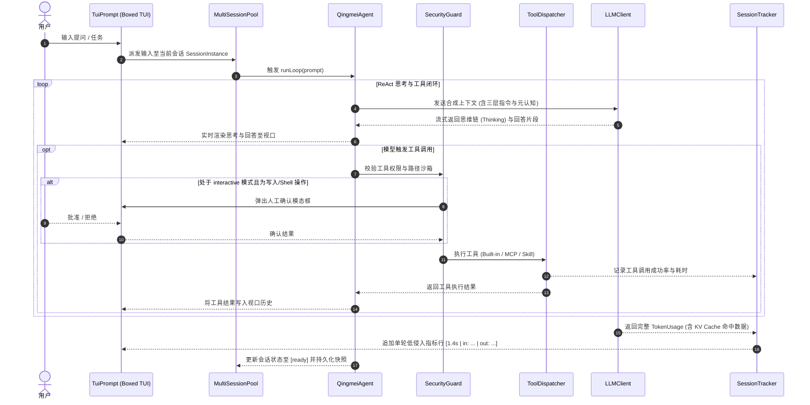

# 青袂 (Qingmei CLI) 系统架构与设计文档 (System Architecture & Design)

<p align="center">
  <a href="DESIGN.md">English</a> | <b>简体中文</b> | <a href="README.zh-CN.md">项目主页</a> | <a href="CHANGELOG.zh-CN.md">更新日志</a>
</p>

---

本文档系统性阐释 **青袂 (Qingmei CLI)** 的工程定位、核心架构设计、关键子系统实现细则及安全与交互哲学。

---

## 1. 系统定位与设计哲学

### 1.1 项目愿景
青袂（Qingmei）是一款基于 TypeScript 和 Node.js 构建的现代化、模块化、高密度自主 AI Agent 命令行开发工具。致力于为工程师提供轻盈灵动、极度聚焦、安全可信且对工作空间**零文件污染**的代码编写与工程推理体验。

### 1.2 核心设计哲学

1. **零参数开箱即用 (Zero-Config Launch)**：
   终端仅需输入 `qingmei` 即可无缝进入全屏交互式 REPL；未配置凭据时由内建向导引导完成探活与初始化，杜绝繁琐参数配置。
2. **零工作区文件污染 (Zero Workspace Pollution)**：
   所有配置文件、会话快照、KV Cache 统计、MCP 服务配置与全局提示词统一收敛至用户主目录 `~/.qingmei/`，严禁在代码仓库根目录遗留任何临时文件与配置文件。
3. **自主 ReAct 推理闭环 (Autonomous ReAct Loop)**：
   多步工具调用、思维链 (Thinking/Reasoning) 实时流式解析、自适应死循环检测与反思自愈机制。
4. **多会话并发控制池 (Multi-Session Concurrency Pool)**：
   单工作区支持多个平铺平行会话，各会话内存状态完全隔离；支持后台非阻塞异步执行与 `Tab` 键快速轮巡切换。
5. **纯文字极简 UI (Zero Icons & High-Density Display)**：
   全界面 100% 杜绝 Emoji 与装饰性图标干扰，采用高密度纯文字状态徽章 (`[running]`, `[ready]`, `[waiting]`, `[done]`, `[error]`)，保持专业终端口感。
6. **纵深防御与工作区沙箱 (Defense in Depth & Path Sandboxing)**：
   4 级安全防御模式矩阵 + 交互式工作区信任门禁 + 物理绝对路径防逃逸沙箱，彻底拦截越界写操作与命令注入。
7. **服务端 KV Cache 意识 (Prompt Cache Awareness)**：
   原生集成主流厂商服务端 Prompt Cache 命中率监控，提供实时每轮低侵入指标展示与会话诊断账单。

---

## 2. 系统总体架构设计

青袂 CLI 采用清晰的分层解耦设计，自顶向下划分为：**终端交互层 (TUI)**、**多会话控制层 (MultiSessionPool)**、**核心推理引擎层 (QingmeiAgent)**、**工具分发与安全沙箱层 (Tool & Security)**、**统计追踪层 (SessionTracker)** 及 **多厂商模型适配层 (LLMClient)**。

```text
┌────────────────────────────────────────────────────────────────────────┐
│                        Qingmei CLI (全屏一体式 TUI)                     │
│  ┌──────────────────────────────────────────────────────────────────┐  │
│  │ 顶部标题栏: 艺术字字符画徽标 + CLI 版本号                         │  │
│  ├──────────────────────────────────────────────────────────────────┤  │
│  │ 中部历史视口 (Operation History Viewport)                        │  │
│  │  - 当前激活会话的历史记录流式渲染                                │  │
│  │  - 原生居中悬浮模态弹窗 (Floating Overlay Modals)                 │  │
│  │  - 悬浮式斜杠指令浮层 (Floating Suggestions - 零视口挤压)        │  │
│  │  - 独立视口滚动指示器 (Shift + Up/Down 浏览)                     │  │
│  ├──────────────────────────────────────────────────────────────────┤  │
│  │ 一体化输入舱: > 用户输入行 (支持多行剪贴板与中文 IME 归一化)      │  │
│  │ 底部状态栏 Line 1: [1.2k/1M] [interactive] [qwen3.8-max] [1M] ... │  │
│  │ 底部状态栏 Line 2: 自适应会话栏/折叠状态 + 工作区相对路径        │  │
│  └──────────────────────────────────────────────────────────────────┘  │
└───────────────────────────────────┬────────────────────────────────────┘
                                    │
┌───────────────────────────────────▼────────────────────────────────────┐
│                    MultiSessionPool 多会话并发控制池                   │
│  ┌─────────────────────────┐  ┌─────────────────────────────────────┐  │
│  │ SessionInstance #1      │  │ SessionInstance #2 (后台并发运行中) │  │
│  │ [ready] - 独立会话记忆  │  │ [running] - 异步非阻塞执行          │  │
│  │ 独立视口行 / 独立上下文 │  │ 独立 AbortController 任务中断信号   │  │
│  │ 独立 SessionTracker     │  │ 独立未提交草稿缓冲区                │  │
│  └─────────────────────────┘  └─────────────────────────────────────┘  │
└───────────────────────────────────┬────────────────────────────────────┘
                                    │
┌───────────────────────────────────▼────────────────────────────────────┐
│                    QingmeiAgent 核心自主推理层 (ReAct Loop)            │
│  ┌──────────────────┐  ┌───────────────────┐  ┌─────────────────────┐  │
│  │ ContextManager   │  │  SessionStorage   │  │   SecurityGuard     │  │
│  │ 三层指令规则合成 │  │  平铺快照持久化   │  │   4-Tier 安全防御模式│  │
│  │ 1M 上下文滑窗    │  │  ~/.qingmei/sess/ │  │   工作区信任/路径沙箱│  │
│  │ 智能 Compaction  │  │                   │  │                     │  │
│  └──────────────────┘  └───────────────────┘  └─────────────────────┘  │
└───────────────────────────────────┬────────────────────────────────────┘
                                    │
┌───────────────────────────────────▼────────────────────────────────────┐
│                       ToolDispatcher 工具分发引擎                       │
│  ┌─────────────────────────┐  ┌────────────────┐  ┌─────────────────┐  │
│  │ Built-in File/Shell 工具 │  │  MCP 扩展工具  │  │  Skill 自定义   │  │
│  │ read/write/edit/exec... │  │ (stdio / sse)  │  │  (SKILL.md 规范)│  │
│  └─────────────────────────┘  └────────────────┘  └─────────────────┘  │
└───────────────────────────────────┬────────────────────────────────────┘
                                    │
┌───────────────────────────────────▼────────────────────────────────────┐
│                  SessionTracker 会话统计与活动追踪器                    │
│  - KV Cache / Prompt Cache 服务端命中率实时核算                        │
│  - 输入 / 输出 / 深度思考 (Reasoning) Token 精确统计                   │
│  - 工具调用频次、成功率及执行耗时矩阵诊断                              │
│  - 低侵入式单轮摘要与优雅退出卡片输出                                  │
└───────────────────────────────────┬────────────────────────────────────┘
                                    │
┌───────────────────────────────────▼────────────────────────────────────┐
│                     LLMClient 多厂商模型适配层 (OpenAI 协议)           │
│  ┌──────────────────┐  ┌──────────────────┐  ┌──────────────────────┐  │
│  │ DeepSeek 预设    │  │ Google Gemini 预设│ │ OpenAI 预设          │  │
│  │ deepseek-v4 系列 │  │ gemini-3.x 系列  │  │ gpt-5.x 系列         │  │
│  ├──────────────────┤  ├──────────────────┤  ├──────────────────────┤  │
│  │ GLM / 智谱 AI    │  │ Grok / xAI       │  │ Qwen / 通义千问      │  │
│  │ GLM-5.x 系列     │  │ grok-4.x 系列    │  │ qwen-3.x 系列        │  │
│  └──────────────────┘  └──────────────────┘  └──────────────────────┘  │
│  - include_usage 自动注入 | 运行时密钥热重载 | 智能降级探测           │
└────────────────────────────────────────────────────────────────────────┘
```

---

## 3. 核心子系统详细设计

### 3.1 多会话并发引擎 (MultiSessionPool)

传统 Agent 终端通常为阻塞式单线程对话：当 Agent 执行耗时构建或长篇分析时，用户无法继续提问或并行处理其他问题。青袂构建了基于内存的多会话并发控制池：

1. **平铺式存储与隔离架构**：
   - 存储路径：`~/.qingmei/sessions/<ws-hash>/<sessionId>.json`。
   - 每个 Workspace 对应多个 flat Sessions，不存在树状嵌套；
   - 每个 `SessionInstance` 拥有独立的对话上下文历史、视口缓冲区、未提交草稿与独立的 `AbortController` 中断句柄。
2. **后台异步非阻塞执行**：
   - 当在会话 A 中触发复杂任务后，用户可立即切入会话 B 进行独立工作，会话 A 将在后台无阻塞继续执行；
   - 会话状态自动流转为 `[running]`，完成后自动转换为 `[ready]` 或 `[done]`；
   - 退出守卫机制（Exit Guard）：执行 `/exit` 时，若检测到后台仍有 `[running]` 会话，主动弹出居中模态框提示用户确认，防止后台任务中断丢失。
3. **极简全单词顶层指令集 (Zero Short-Flags)**：
   彻底废弃模糊的单字母短参数，定义语义明晰的顶层指令：
   - `/new [name]`：新建并切入新会话；
   - `/switch [id]`：快速切换会话（空参弹出交互式选择浮层，或在输入框为空时按 `Tab` 键快速轮巡）；
   - `/sessions`：查看所有活跃会话与磁盘归档快照；
   - `/rename [name]`：重命名当前活动会话；
   - `/close [id]`：关闭并释放指定会话内存（自动平滑回退至相邻会话）；
   - `/save [name]`：命名持久化快照至磁盘；
   - `/resume [id]`：从磁盘快照唤醒恢复会话；
   - `/delete [id]`：删除磁盘快照（支持批量选择模态框与 `/delete all`）；
   - `/export [id]`：导出对话记录为 Markdown 报告。

### 3.2 全包围 Boxed TUI 交互系统

1. **自适应双层状态栏**：
   - **Line 1 (指标栏)**：展示实时上下文滑窗使用量（如 `[1.2k/1M (<0.1%)]`）、运行模式 `[interactive]`、活动模型 `[qwen3.8-max]`、规格徽章 `[1M]`、推理强度 `[high]` 及未信任警告。
   - **Line 2 (自适应会话栏 + 路径)**：
     - *标准模式 (1~4 个会话)*：`[#1 (running)] [#2]* [#3] | ~/path`
     - *紧凑模式 (4~6 个会话)*：`[#1 (running)] [#2] [#3] [#4]* [#5] | ~/path`
     - *超宽折叠模式 (>6 个会话或窄屏)*：`#5* [running] (8 sessions: 2 running, 6 ready) | ~/path`
2. **单流输入流水线 (Single-Stream Input Pipeline)**：
   - 彻底解决 Node.js 终端下原生 Raw 模式、中文输入法（IME）Composition 事件与 Bracketed Paste 剪贴板粘贴导致字符重复乱码的业界难题；
   - 统一采用单输入缓冲区与字符光标偏移模型，精准支持多行文本预览（`(+N lines)`）。
3. **视口滚动浏览与按键专职化**：
   - `Shift + Up` / `Shift + Down`：专职用于上下平滑浏览主视口历史对话；
   - 滚动离开底部时呈现浮动徽章：`▲ Scrolled back N lines [X-Y/Total] (Shift+Down to return)`；
   - `Up` / `Down`：严格专职用于输入舱历史命令回退与下拉自动补全选择，职责完全解耦。
4. **终端尺寸缩放原子擦除**：
   - 终端窗口调整大小时，底层捕获 `resize` 并通过 `\x1b[2J\x1b[3J\x1b[H` 彻底重置缓冲区，且在每帧末尾追加 `\x1b[J` 消除残余行，杜绝缩小时出现重影状态栏。

### 3.3 纵深防御与工作区沙箱机制

为应对提示词注入攻击（Prompt Injection）和恶意依赖提权，青袂设计了三层防御矩阵：

1. **4 级安全防御模式矩阵**：
   - **`[interactive]` (默认交互模式)**：只读工具（`read_file`, `list_dir` 等）自动放行；文件写入、修改与终端 Shell 命令执行前强制在主视口弹出确认提示，由人工授权。
   - **`[auto]` (全自主执行模式)**：全自主放行执行工具链，适合受信任自动化批量运维。
   - **`[readonly]` (严格只读分析模式)**：物理拦截写文件与 Shell 执行，专门用于安全代码审查与只读分析。
   - **`[chat]` (纯对话模式)**：从 System Prompt 中彻底移除所有 Tool Schema，模型零开销极速输出，彻底杜绝幻觉调用工具。
2. **工作区信任门禁 (Workspace Trust)**：
   - 首次打开未经授权的目录时，CLI 主动阻断并弹出信任模态框；
   - 未经信任前，工作区被物理锁定在受限只读模式，无法执行任何系统命令或写操作。
3. **底层绝对路径沙箱拦截 (Path Sandboxing)**：
   - 规范化（`path.resolve`）并校验所有工具的目标绝对路径；
   - 严格拦截任何跨越当前工作区根目录的目录穿越（Path Traversal）行为，敏感系统文件（如 `/etc`, `~/.ssh`）受物理级隔离保护。

### 3.4 三层指令规则与上下文管理 (Context Engine)

1. **三层合成指令体系 (Layered Instructions)**：
   - **全局用户偏好**：`~/.qingmei/QINGMEI.md`（跨工作区长期生效）；
   - **项目级开发规范**：`./AGENTS.md`（特定工程根目录生效）；
   - **技能动态指令**：激活的 `SKILL.md`（根据用户使用的技能按需装载）。
2. **运行时元认知上下文注入 (Runtime Meta-Context)**：
   - 在 System Prompt 元数据区域显式注入：当前 Provider、活动模型名称、上下文窗口规格、可用斜杠命令及已配置可选模型列表；
   - 规约 Agent 在回答自身运行时与模型配置问题时，直接提取元认知数据，禁止盲目调用工具扫描工作区代码或执行 Shell 命令。
3. **上下文智能压缩 (Compaction Engine)**：
   - 具备 1M 超大上下文感知与自适应滑窗计算；
   - 当上下文超过阈值（默认 60%）时，自动触发增量压缩：折叠历史过长工具输出并提取关键进展，保留最近对话焦点。

### 3.5 扩展生态：MCP 协议与 Skill 体系

1. **Model Context Protocol (MCP) 原生集成**：
   - 原生支持基于 `stdio` 隔离子进程沙箱与远程 `sse` 端点的 MCP 服务；
   - 自动命名空间隔离：`mcp__<server>__<tool>`，避免不同 MCP 服务间工具重名冲突；
   - 配置文件收敛于 `~/.qingmei/mcp.json`，独立管理。
2. **Skill 技能体系**：
   - 严格遵循标准 `SKILL.md` 元数据与 YAML 前导规范；
   - 支持全局技能仓库 `~/.qingmei/skills/` 与项目内技能热插拔注入；
   - 通过 `/skills` 指令可一键查看、激活或禁用技能。

### 3.6 Prompt Cache 与 Token 追踪体系 (SessionTracker)

针对现代大语言模型高并发、多轮对话下 Token 成本与响应延迟问题，青袂设计了专门的统计追踪子系统：

1. **服务端 KV Cache / Prompt Cache 数据采集**：
   - 流式请求自动注入 `stream_options: { include_usage: true }`；
   - 统一解析各家 Provider 返回的缓存命中指标（包括 OpenAI `prompt_tokens_details.cached_tokens`、DeepSeek `prompt_cache_hit_tokens` 等）；
   - 零值安全保护，杜绝除以零造成的 `NaN`。
2. **单轮低侵入极简纯文本输出**：
   - 回复完成后，在末尾附带单行紧凑纯文本状态行：
     - 命中缓存：`[1.4s | in: 1,200 (cached: 1,000, 83.3%) | out: 300]`
     - 包含深度思考：`[2.8s | in: 1,820 (cached: 1,400, 76.9%) | out: 450 (reasoning: 320)]`
     - 未命中缓存：`[950ms | in: 400 | out: 120]`
3. **交互分析命令**：
   - **`/usage`**：展示当前会话详细 Token 结构、缓存命中利用率与节省统计；
   - **`/stats`**：展示会话全景活动诊断，包含总耗时、对话轮次、工具调用成功率与 Token 消耗矩阵。
4. **退出总结卡片 (Exit Summary UI)**：
   - 退出 CLI 时展示与顶部标题栏一致的青色 `QINGMEI` 点阵文字图标与高亮版本号；
   - 结构化分行显示（`Duration:`, `Turns:`, `Input:`, `Output:`, `Total:`）；
   - 维持纯文本设计，0 请求空会话自动保持静默，不污染终端。

### 3.7 动态配置与运行时热重载 (LLMClient & Key Fallback)

1. **`/key` 统一密钥管理中心**：
   - 脱敏预览（`DeepSeek (sk-****3f9a)`）、连通性轻量探活与诊断建议；
   - 支持快捷命令：`/key deepseek sk-xxxx` 与 `/key rm deepseek`。
2. **运行时客户端热重载**：
   - 修改当前活动厂商 Key 时，即刻热重载内存中的 `LLMClient`，不中断当前会话且完整保留对话记忆；
   - 切换非当前厂商 Key 时，弹出直观选项供选择是否直接切换模型。
3. **智能降级策略 (Smart Fallback)**：
   - 删除当前厂商 Key 时，自动检测其他已配置的可用厂商，并推荐一键平滑降级切换，无缝刷新状态栏。

---

## 4. 端到端执行数据流 (Execution Sequence)



---

## 5. 存储架构与零工作区污染设计

所有持久化文件统一归档至用户主目录 `~/.qingmei/`：

```text
~/.qingmei/
├── config.json            # 全局配置 (当前厂商、模型、安全模式、思考强度等)
├── mcp.json               # MCP 服务器配置 (stdio 进程命令与环境变量)
├── QINGMEI.md             # 用户全局指令 (跨项目通用原则)
├── sessions/              # 多会话平铺快照仓库
│   └── <workspace-hash>/  # 按工作区路径 Hash 隔离
│       ├── sess_xxxx.json # 会话上下文与运行快照
│       └── sess_yyyy.json
├── export/                # /export 指令导出的 Markdown 报告
└── skills/                # 全局自定义技能仓库 (SKILL.md)
    └── <skill-name>/
        └── SKILL.md
```

---

## 6. 官方预设厂商与模型矩阵 (Supported Providers)

青袂目前官方预设支持以下 6 大主流 AI 厂商（全量预设模型均原生支持 1M 超长上下文，自动开启 Prompt Cache 追踪）：

| 厂商 Provider | ID | 默认模型 | 预设模型列表 | 环境变量 |
| :--- | :--- | :--- | :--- | :--- |
| **DeepSeek** | `deepseek` | `deepseek-v4-flash` | `deepseek-v4-flash`, `deepseek-v4-pro` | `DEEPSEEK_API_KEY`, `DEEPSEEK_BASE_URL` |
| **Google Gemini** | `gemini` | `gemini-3.8-flash` | `gemini-3.8-flash`, `gemini-3.7-flash`, `gemini-3.6-flash`, `gemini-3.1-pro-preview` | `GEMINI_API_KEY`, `GEMINI_BASE_URL` |
| **OpenAI** | `openai` | `gpt-5.6-sol` | `gpt-5.6-sol`, `gpt-5.6-terra`, `gpt-5.6-luna`, `gpt-5.5`, `gpt-5.4-mini` | `OPENAI_API_KEY`, `OPENAI_BASE_URL` |
| **GLM / 智谱 AI** | `glm` | `GLM-5.3-Flash` | `GLM-5.3-Flash`, `GLM-5.3`, `GLM-5.2` | `ZHIPU_API_KEY`, `ZHIPU_BASE_URL` |
| **Grok / xAI** | `grok` | `grok-4.6` | `grok-4.6`, `grok-4.5`, `grok-4.3` | `XAI_API_KEY`, `XAI_BASE_URL` |
| **Qwen / 通义千问** | `qwen` | `qwen3.8-max` | `qwen3.8-max`, `qwen3.8-flash`, `qwen3.7-plus`, `qwen3.7-flash` | `DASHSCOPE_API_KEY`, `DASHSCOPE_BASE_URL` |

---

## 7. 结语

青袂 CLI 通过将**自主推理能力**、**非阻塞多会话架构**、**服务端 KV Cache 精细化追踪**与**全屏纯文本极简 TUI** 深度交织，为开发者呈现一款轻量极速、高可靠、零负担的专业级命令行 AI 伙伴。
